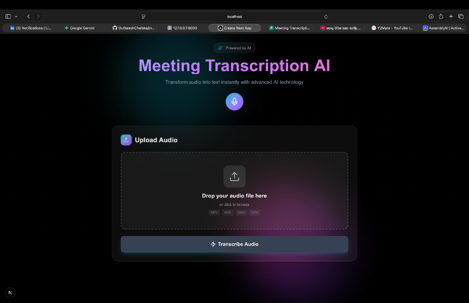
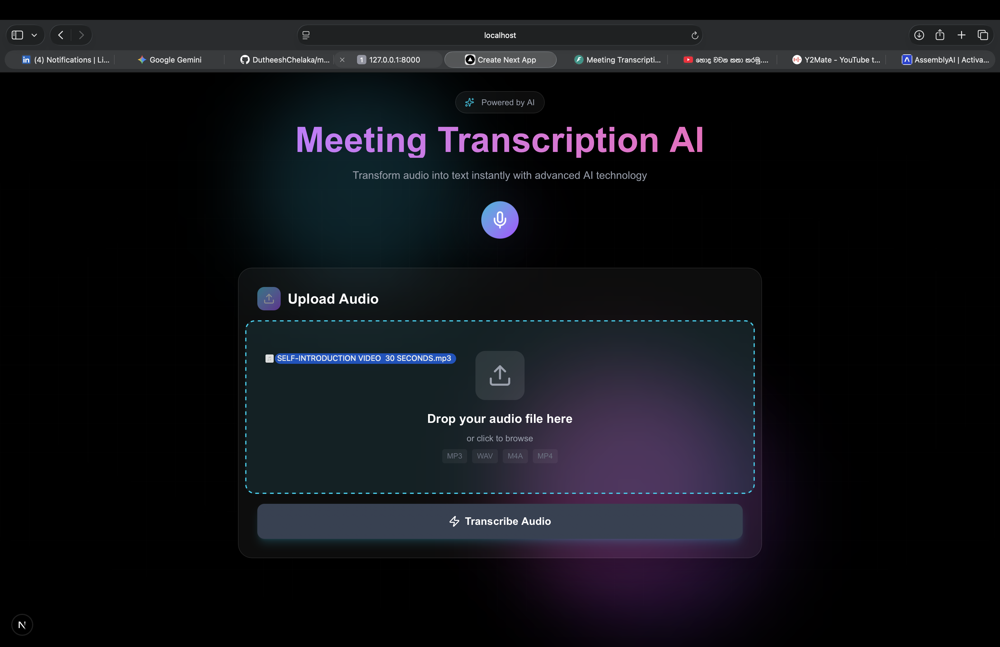
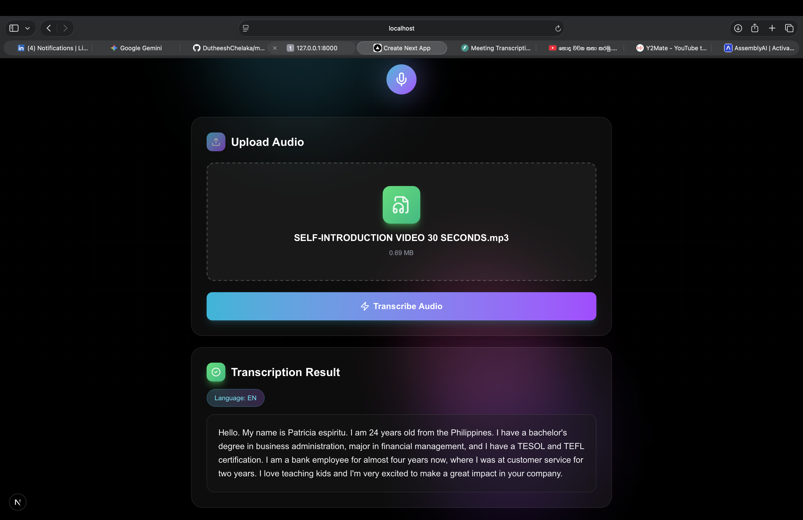
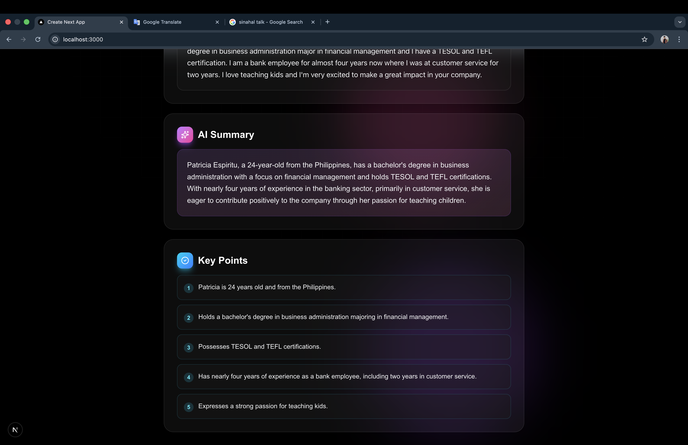

# Meeting Transcription AI

An intelligent full-stack application that transforms audio recordings into actionable insights through automated transcription and AI-powered summarization.

## Overview

This project addresses the common challenge of extracting meaningful information from meeting recordings. Instead of manually listening to hours of audio, users can upload their recordings and receive instant transcriptions along with structured summaries, key points, and action items.

The application leverages OpenAI's Whisper API for accurate speech-to-text conversion and GPT-4 for intelligent content analysis, all wrapped in a modern, intuitive user interface.

## Key Features

**Audio Transcription**
- Supports multiple audio formats: MP3, WAV, M4A, MP4, WEBM
- Automatic language detection across 99+ languages
- High accuracy transcription powered by OpenAI Whisper
- Special handling for Sinhala and Tamil languages with GPT-based encoding correction

**Intelligent Summarization**
- Executive summaries generated by GPT-4
- Automatic extraction of key discussion points
- Identification of action items and assigned responsibilities
- Tracking of decisions made during meetings

**User Experience**
- Drag-and-drop file upload interface
- Real-time processing feedback
- Clean, responsive dark theme design
- Immediate display of results with organized sections

## Technical Architecture

### Backend (Python/FastAPI)

The backend is built with FastAPI, providing a robust RESTful API for audio processing and AI integration.

**Core Components:**
- `transcription_service.py` - Handles Whisper API integration and language-specific processing
- `summarization_service.py` - Manages GPT-4 communication for content analysis
- `transcription.py` - API endpoints for file upload and transcription
- `summarization.py` - API endpoints for summary generation

**Key Technologies:**
- FastAPI for high-performance async API
- OpenAI Python SDK for AI service integration
- Python-multipart for file handling
- Environment-based configuration for security

### Frontend (Next.js/React)

The frontend uses Next.js 16 with the App Router, providing a modern React experience with server-side capabilities.

**Implementation Details:**
- TypeScript for type safety
- Tailwind CSS v4 for styling
- Axios for API communication
- Custom animations and transitions
- Responsive design principles

### Project Structure
```
meeting-transcription-ai/
├── backend/
│   ├── app/
│   │   ├── api/
│   │   │   ├── transcription.py
│   │   │   └── summarization.py
│   │   ├── services/
│   │   │   ├── transcription_service.py
│   │   │   └── summarization_service.py
│   │   └── main.py
│   ├── venv/
│   ├── .env
│   └── requirements.txt
├── frontend/
│   ├── app/
│   │   ├── page.tsx
│   │   ├── layout.tsx
│   │   └── globals.css
│   ├── package.json
│   └── tsconfig.json
└── screenshots/
```

## Screenshots

### Main Interface


### Drag and Drop Upload


### Transcription Results


### AI-Powered Summary


## Getting Started

### Prerequisites

You'll need the following installed on your system:
- Python 3.9 or higher
- Node.js 16 or higher
- An OpenAI API key (obtain from platform.openai.com)

### Installation

**Clone the repository:**
```bash
git clone https://github.com/DutheeshChelaka/meeting-transcription-ai.git
cd meeting-transcription-ai
```

**Set up the backend:**
```bash
cd backend
python3 -m venv venv
source venv/bin/activate  # On Windows: venv\Scripts\activate
pip install -r requirements.txt
```

Create a `.env` file in the backend directory:
```env
OPENAI_API_KEY=your_api_key_here
SECRET_KEY=your_secret_key_here
ENVIRONMENT=development
```

**Set up the frontend:**
```bash
cd frontend
npm install
```

### Running the Application

Start the backend server:
```bash
cd backend
source venv/bin/activate
uvicorn app.main:app --reload
```
The API will be available at http://localhost:8000

Start the frontend development server:
```bash
cd frontend
npm run dev
```
The application will be available at http://localhost:3000

## API Documentation

### Transcription Endpoint
```
POST /api/transcribe
Content-Type: multipart/form-data
```

Accepts an audio file and returns the transcription along with detected language information.

**Response:**
```json
{
  "success": true,
  "transcript": "Transcribed text content...",
  "language": "EN",
  "duration": 125.4
}
```

### Summarization Endpoint
```
POST /api/summarize
Content-Type: application/json
```

Processes transcript text and generates structured insights.

**Request:**
```json
{
  "transcript": "Meeting transcript text...",
  "quick": false
}
```

**Response:**
```json
{
  "success": true,
  "summary": "Executive summary of the meeting...",
  "key_points": ["Point 1", "Point 2", "Point 3"],
  "action_items": ["Task 1", "Task 2"],
  "decisions": ["Decision 1", "Decision 2"]
}
```

## Language Support

The application supports transcription in over 99 languages through OpenAI's Whisper model. English, Spanish, French, German, and other major languages work with excellent accuracy.

For Sinhala and Tamil languages, the system includes an additional GPT-4 based encoding correction step to handle character encoding challenges inherent in the Whisper API's output for these specific languages.

## Technical Decisions

**Why OpenAI Whisper?**
Whisper provides state-of-the-art transcription accuracy across a wide range of languages and audio conditions. The API-based approach eliminates the need for local model hosting while maintaining high quality results.

**Why GPT-4 for Summarization?**
GPT-4's strong reasoning capabilities make it excellent for understanding context and extracting meaningful insights from conversations. The model reliably generates structured output that can be parsed into discrete components (summary, key points, etc.).

**Sinhala/Tamil Encoding Solution**
The Whisper API occasionally returns Sinhala and Tamil transcriptions in incorrect character encodings. Rather than accepting this limitation, I implemented a two-step process: first getting the phonetic transcription from Whisper, then using GPT-4 to correct the encoding based on the detected language. This creative solution demonstrates problem-solving while maintaining the benefits of using OpenAI's ecosystem.

## Development Workflow

The project follows a professional Git workflow with feature branches:

1. Create feature branches for new functionality
2. Implement and test changes
3. Commit with descriptive messages
4. Merge to main branch
5. Push to GitHub

This approach maintains a clean commit history and makes collaboration straightforward.

## Future Enhancements

**Planned Features:**
- Database integration for saving meeting history
- Export functionality (PDF, DOCX, TXT formats)
- Speaker diarization to identify individual speakers
- Real-time transcription for live meetings
- User authentication and personal libraries
- Cloud deployment for public access

## Cost Considerations

The application uses OpenAI's pay-as-you-go pricing:

- Whisper API: $0.006 per minute of audio
- GPT-4-mini API: approximately $0.01 per summary

For development and testing, a $5 OpenAI credit provides roughly 380 complete transcription and summarization cycles, which is sufficient for extensive testing and demonstration purposes.

## Contributing

Contributions are welcome. Please feel free to submit pull requests or open issues for bugs and feature requests.

## License

This project is available under the MIT License.

## Author

Built by Dutheesh Chelaka as a portfolio project demonstrating full-stack development capabilities with AI integration.

GitHub: [@DutheeshChelaka](https://github.com/DutheeshChelaka)

---

For questions or feedback, please open an issue on the GitHub repository.